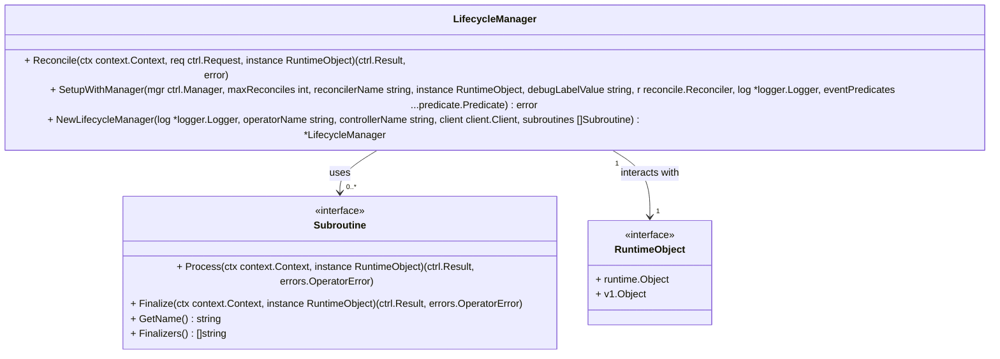

# Controllers

The controllers folder contains several packages related to writing kubernetes operators/controllers and their lifecycle management.

Packages:
- client
- conditions
- errors
- filter
- lifecycle

## Package 'lifecycle'

### Class Diagram



### Usage

The purpose of this library is to simplify the process of writing an operator. This is done in the user code by creating a subroutine and implementing the `Subroutine` interface:

```go
const (
    ExtensionClassSubroutineName      = "ExtensionclassDeletionSubroutine"
    ExtensionClassSubroutineCondition = "ExtensionClassReadyForDeletion"
)

// interface to implement
type Subroutine interface {
	Process(ctx context.Context, instance RuntimeObject) (ctrl.Result, errors.OperatorError)
	Finalize(ctx context.Context, instance RuntimeObject) (ctrl.Result, errors.OperatorError)
	GetName() string
	Finalizers() []string
}

type NewSubroutine struct {
	client client.Client
}

func (r *NewSubroutine) GetName() string {
	return ExtensionClassSubroutineName
}

func (r *NewSubroutine) Finalize(ctx context.Context, runtimeObj lifecycle.RuntimeObject) (ctrl.Result, errors.OperatorError) {
	return ctrl.Result{}, nil
}

func (r *NewSubroutine) Finalizers() []string {
	return []string{config.ExtensionClassCleanupFinalizer}
}

func (r *NewSubroutine) Process(ctx context.Context, runtimeObj lifecycle.RuntimeObject) (ctrl.Result, errors.OperatorError) {
	extensionClass := runtimeObj.(*extensionsV1alpha1.ExtensionClass)
    if extensionClass.Spec.Type == nil {
        return ctrl.Result{}, errors.NewOperatorError(errors.New("ExtensionClass type is not set"), true, false)
    }
    // do something
	
    return ctrl.Result{}, nil
}
```

Then the user implements a `Reconciler` class which calls the `Reconcile` and `SetupWithManager` functions in the `lifecycle` package instead those in the controller runtime. The subroutines are registered and passed as parameter to the `lifecycle.NewLifecycleManager` call:

```go
type NewReconciler struct {
	lifecycle *lifecycle.LifecycleManager
}

func NewNewReconciler(log *logger.Logger, mgr ctrl.Manager, cfg config.Config) *NewReconciler {
	subs := []lifecycle.Subroutine{}
	subs = append(subs, subroutines.NewSubroutine(mgr.GetClient()))
	return &NewReconciler{
		lifecycle: lifecycle.NewLifecycleManager(log,
			"manager-name",
			"reconciler-name",
			mgr.GetClient(),
			subs),
	}
}

func (r *NewReconciler) Reconcile(ctx context.Context, req ctrl.Request) (ctrl.Result, error) {
	return r.lifecycle.Reconcile(ctx, req, &v1alpha.CustomResource{})
}

func (r *NewReconciler) SetupWithManager(mgr ctrl.Manager, cfg config.Config, log *logger.Logger, eventPredicates ...predicate.Predicate) error {
	return r.lifecycle.SetupWithManager(mgr, cfg.MaxConcurrentReconciles, "reconciler-name", &v1alpha.CustomResource{}, cfg.DebugLabelValue, r, log, eventPredicates...)
}
```

Features of the `lifecycle` package:
- timestamp management
- spread reconciles
- condition management
- finalization and subroutine processing
- status update
- tracing
- logger management

### Configuration

```go
// SetupWithManager
func (l *LifecycleManager) SetupWithManager(mgr ctrl.Manager, maxReconciles int, reconcilerName string, instance RuntimeObject, debugLabelValue string, r reconcile.Reconciler, log *logger.Logger, eventPredicates ...predicate.Predicate) error
```

The **debugLabelValue** parameter enables filtering of the resources based on a `debug.openmfp.io` label. If the label has the value passed in **debugLabelValue**, the resource will be reconciled in the `Process` function of the subroutine and all other resources will be skipped. If the value is empty string, all resources will be reconciled. This could be useful in debuging situations.

```yaml
apiVersion: myorg.com/v1alpha1
kind: CustomResource
metadata:
  name: resource1
  namespace: mynamespace
  labels:
    debug.openmfp.io: test
```
